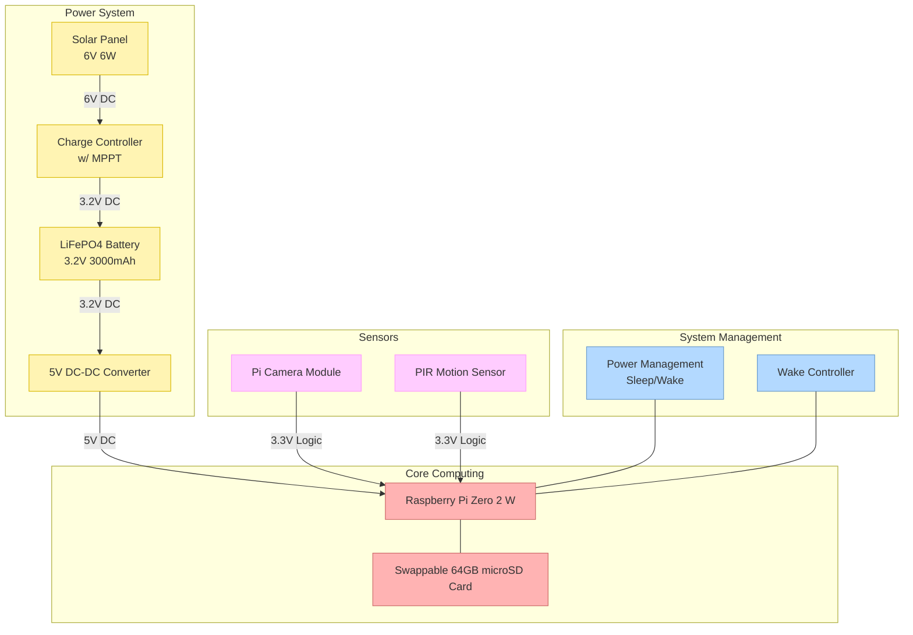

# birb id 

birb id is a smart hummingbird feeder system that:

1. Detects when a hummingbird is feeding
2. Automatically records video/images of the visitor
3. Uses machine learning in post combined with human labeling to identify hummingbird species

## electronic bits

The birb id system uses the following electrical components:

## machine learning

The machine learning component of birb id works in three stages:

1. **Detection**: A lightweight motion detection algorithm runs directly on the Raspberry Pi to conserve power. When motion is detected near the feeder, the system wakes up and begins recording.

2. **Classification**: Captured images are processed through a convolutional neural network (CNN) model that's been trained on thousands of hummingbird images. The model identifies distinctive features like throat color, wing shape, and size to make an initial species prediction.

3. **Human-in-the-loop**: For uncertain classifications or to improve the model, images are periodically sent to our web interface where bird enthusiasts can verify or correct the AI's predictions. This feedback loop continuously improves identification accuracy without requiring constant human monitoring.

The system can currently identify 15+ North American hummingbird species with over 85% accuracy, including ruby-throated, rufous, and Anna's hummingbirds, even in challenging lighting conditions.

## power & connectivity

The solar-powered design allows birb id to operate autonomously for months without battery changes. When in range of your home WiFi, it will automatically upload new hummingbird sightings to your personal dashboard. For remote locations, an optional LTE module enables connectivity anywhere with cellular service.

happy birb watching!
